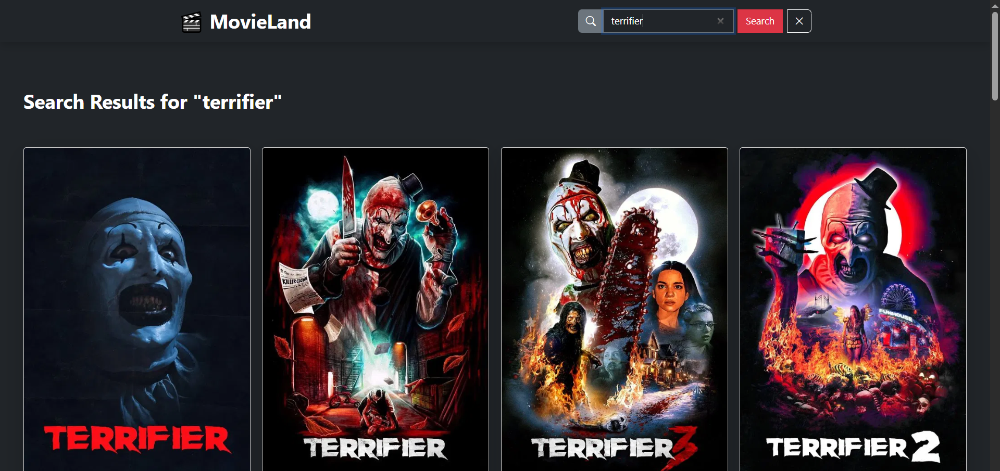
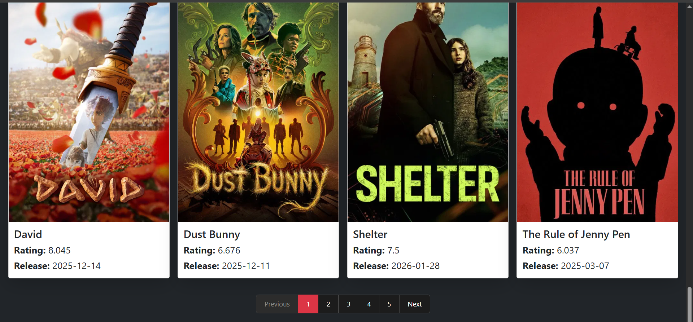
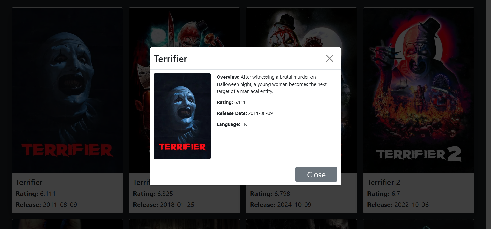

# ✅ MovieLand | Angular Movie Landing App (TMDB API)

A modern **Movie Landing Application** built using **Angular (Standalone Components)**, **TMDB Movie API**, and **Bootstrap 5**.  
The app showcases trending, popular, searchable movies with dynamic pagination, a smooth UI, global loader, and centralized error handling.

---

## 🎨 Features

- 🎬 Trending movies carousel
- 🔍 Search movies by name
- ⭐ Popular movies section
- 🎞️ All movies listing
- 📄 Server-side pagination for movies
- 🪟 Movie details in Bootstrap modal
- ⏳ Global loader using HTTP interceptor
- ❌ Centralized API error handling
- 🎨 Clean and responsive UI
- 📱 Mobile-friendly layout
- ⚡ Modern Angular syntax (`@if`, `@for`)

---

## 🛠️ Built With

| Technology                         | Purpose                     |
| ---------------------------------- | --------------------------- |
| 🅰️ Angular (Standalone Components) | Frontend framework          |
| 🎥 TMDB API                        | Movie data provider         |
| 🌐 Angular HttpClient              | API communication           |
| 🔄 RxJS                            | Async data handling         |
| 🛡️ HTTP Interceptors               | Loader & error handling     |
| 📄 Bootstrap Pagination            | Server-side page navigation |
| 🎨 Bootstrap 5                     | UI layout & responsiveness  |
| 🧩 Bootstrap Icons                 | Icons                       |
| 🎨 CSS                             | Custom styling              |

---

## 📸 Screenshots

### 🎬 Home Page

### 🔍 Search Movies

### 📄 Pagination

### 🎞️ Movie Details Modal

---

## 🌐 Live Demo

🌐 **Netlify Live Demo:**  
👉 https://angular-movieland-app-using-tmdb.netlify.app

---

## 🔑 API Used

**TMDB (The Movie Database) API**

- Trending movies
- Popular movies
- Search movies by keyword
- Paginated movie results
- High-quality posters & backdrops

_(API key stored securely in environment file)_

---

## 📄 Pagination Implementation

- Server-side pagination using TMDB `page` parameter
- Dynamic page number generation
- Previous / Next navigation
- Active page highlighting
- Smooth scroll to top on page change
- Limited to first 20 pages for performance optimization

---

## 🔐 Error Handling

- 400 – Bad Request
- 401 – Unauthorized
- 404 – Not Found
- 500 – Server Error

Handled globally using an HTTP Error Interceptor.

---

## ⏳ Global Loader

The loader appears during:

- Fetching trending movies
- Fetching popular movies
- Fetching paginated movies
- Searching movies
- Any HTTP API call

Implemented using a request-count–based loader interceptor.

---

## 📂 Pages / Sections

- **Home**
  - Trending carousel
  - Popular movies
  - All movies with pagination
- **Search Results**
  - Dynamic movie search
  - Clear search to return home
- **Movie Details**
  - Bootstrap modal with full movie information

---

## 🚀 Angular Concepts Used

- Standalone Components
- Functional HTTP Interceptors
- Dependency Injection using `inject()`
- Template-driven forms (`ngModel`)
- Modern control flow (`@if`, `@for`)
- Dynamic pagination logic
- Component reusability

---

## 📧 Let’s Connect

🔗 **LinkedIn**  
https://www.linkedin.com/in/gaurav-lad1974

📨 **Email**  
gauravlad1974@gmail.com
